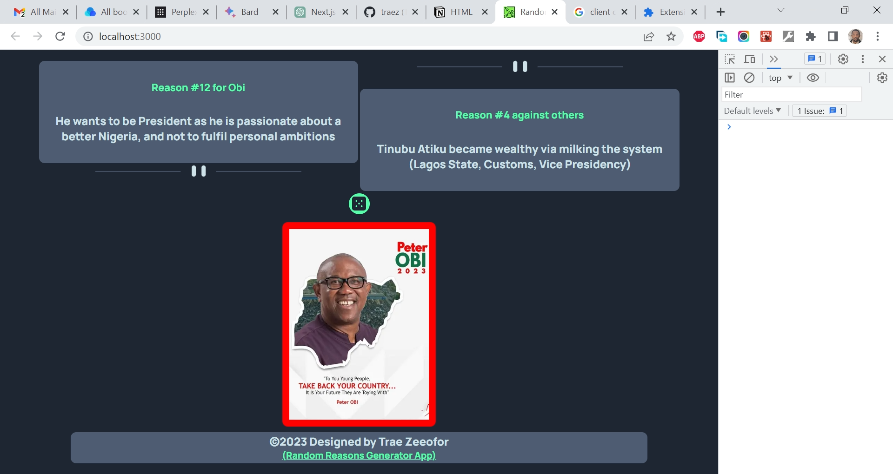

# Frontend Mentor - Advice generator app solution

This is a solution to the [Advice generator app challenge on Frontend Mentor](https://www.frontendmentor.io/challenges/advice-generator-app-QdUG-13db). Frontend Mentor challenges help you improve your coding skills by building realistic projects.

## Table of contents

- [Overview](#overview)
  - [The challenge](#the-challenge)
  - [Screenshot](#screenshot)
  - [Links](#links)
- [My process](#my-process)
  - [Built with](#built-with)
  - [What I learned](#what-i-learned)
  - [Continued development](#continued-development)
  - [Useful resources](#useful-resources)
- [Author](#author)
- [Acknowledgments](#acknowledgments)

## Overview

### The challenge

Users should be able to:

- View the optimal layout for the app depending on their device's screen size
- See hover states for all interactive elements on the page
- Generate a new piece of advice by clicking the dice icon

### Screenshot

### Links

- Solution URL: [https://github.com/traez/random-reasons-generator-app](https://github.com/traez/random-reasons-generator-app)
- Live Site URL: [https://random-reasons-generator-app-traez.vercel.app/](https://random-reasons-generator-app-traez.vercel.app/)

## My process

### Built with

- Semantic HTML5 markup
- CSS custom properties
- Flexbox
- CSS Grid
- Mobile-first workflow
- [React](https://reactjs.org/) - JS library
- [Next.js](https://nextjs.org/) - React framework

### What I learned

1. As React.js is an improvement on JavaScript, I fully got to understand why Next.js is an improvement on React.js. I'm now a firm believer!  
2. Got to use "place-content: center"; CSS property. I understand it's a shorthand property that combines the align-content and justify-content properties. 
3. Introduced to the concept and benefits of storing text in markdown files rather than in JavaScript files. 

### Continued development

More Next.js projects. GraphQL projects too in the longer term.

### Useful resources

Stackoverflow  
YouTube  
Google  
ChatGPT  

## Author

- Website - [Trae Zeeofor](https://github.com/traez)  
- Twitter - [@trae_z](https://twitter.com/trae_z) 

## Acknowledgments

[Solomon Ekrebe](https://github.com/krebeDev), [Okeowo Aderemi](https://github.com/dojoVader) and [Chinonso Ani](https://github.com/KingNonso) have been very helpful. Thank you.
